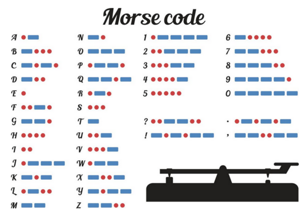
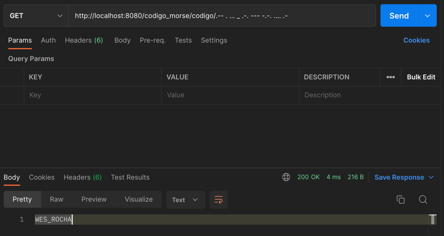

# Código Morse - (Prática Integradora II)

-> Objetivo

O objetivo deste exercício é poder consolidar e aprofundar os conceitos de criação
de APIs com Spring Boot. Para isso, propõe-se uma série de exercícios simples que
permitem rever os tópicos trabalhados nas aulas.

Exercício

O Código Morse permite que cada caractere do alfabeto seja codificado como uma
sequência de "pontos" e "hífens". Por exemplo, a letra A é codificada como · -, a letra
Q é codificada como −− · -, e o dígito 1 é codificado como · −−−−.

O código Morse não diferencia maiúsculas de minúsculas, no entanto, suas traduções
são tradicionalmente exibidas em letras maiúsculas. Quando a mensagem é escrita
em código Morse, um único espaço é usado para separar os códigos de caracteres e
3 espaços são usados para separar as palavras.

● Solicita-se a realização de uma API que receba um Código Morse e retorne
sua tradução em português. Consulte o significado de cada símbolo na tabela
a seguir:

<b>Algunos Exemplos:</b>
  
--- .-.. .- OLA  
-- . .-. -.-. .- -.. --- .-.. .. ...- .-. . MERCADO LIVRE 
... .--. .-. .. -. --. SPRING

{curl --location --request GET 'http://localhost:8080/codigo_morse/codigo/.-- . ... _ .-. --- -.-. .... .-'}

